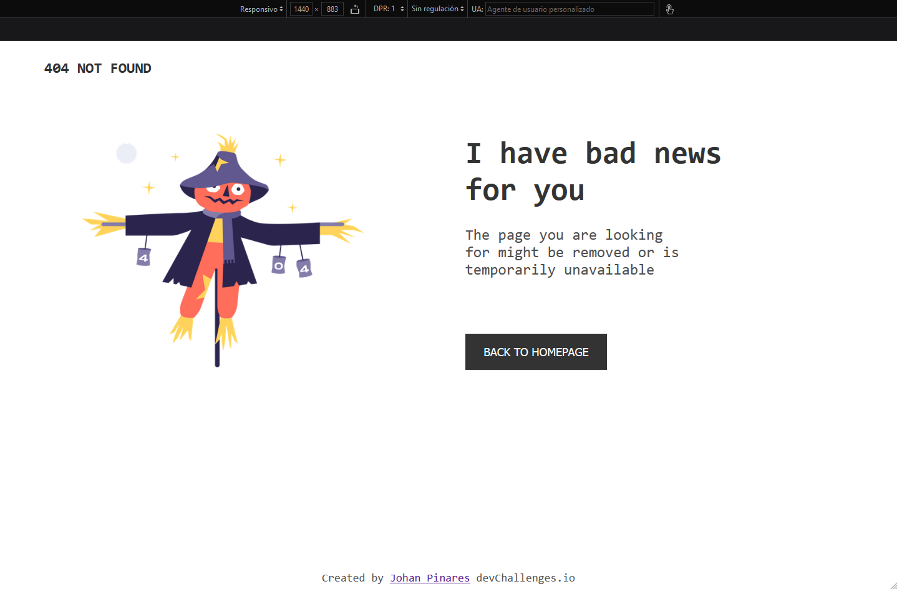

# Make It Real - Página 404 Not found

Solucion a la tarea de makeitreal de replicar la pagina 404

## Tabla de Contenidos

- [Resumen](#resumen)
- [El desafío](#el-desafío)
- [Pantallazo](#pantallazo)
- [Mi proceso](#mi-proceso)
- [Tecnología utilizada](#tecnología-utilizada)
- [Lo que aprendí](#lo-que-aprendí)
- [Desarrollo a futuro](#desarrollo-a-futuro)
- [Recursos útiles](#recursos-útiles)
- [Autor](#autor)
- [Agradecimientos](#agradecimientos)

## Resumen
Se verifica la estructura de la pagina tanto mobile como desktop de manera responsive 1440px y 375px
### El desafío

Los usuarios deben ser capaces de:

Entrar al indx.html y verificar la pagin 404 responsive

### Pantallazo

Se muestra el pantallazo del modo escritorio y mobile, ee utilizó el archivo CSS con variables de colores :root como base para definir los colores del diseño. Esta metodología permite una fácil gestión y modificación de los colores a lo largo del desarrollo del estilo.

## Mi proceso

### Tecnología utilizada

- HTML
- CSS

### Lo que aprendí

Aprendi a estructurar mi html y definir variables necesarias de usar cajas osea div y darle su estilo mediante css dando diversos estilos a gusto de cada uno

### Desarrollo a futuro

Me enfocare a reducir mi linea de codigos en el css siento que aumento mucho
### Recursos útiles

Tutoriales de html y css
Codeacademy - vi su pagina web de html y css desde cero
## Autor

- Github - [@JohanEmersonPinares](https://github.com/JohanEmersonPinares)

## Agradecimientos

Agradezco a los tutores por brindar tareas y generen la investigacion para aprender mas
